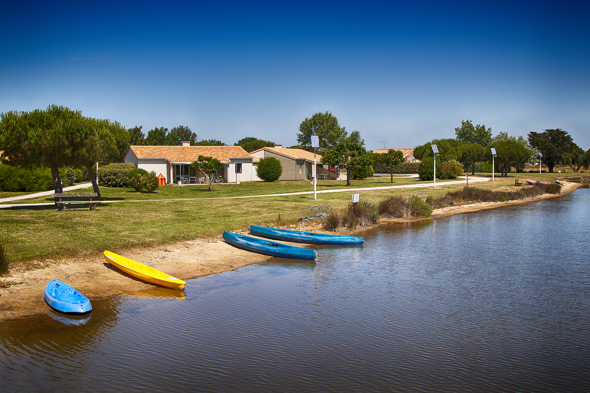

```{r setup, echo=FALSE, cache=FALSE}
library(knitr)
## Global options
options(max.print="100")
opts_chunk$set(echo=TRUE,
               cache=TRUE,
               prompt=FALSE,
               tidy=TRUE,
               comment=NA,
               message=FALSE,
               warning=FALSE)
knitr::opts_chunk$set(fig.height = 8, fig.width = 12, fig.align = 'center') 
```


L'objet de cette mise en application consiste à qualifier l'environnement géographique des villages du Comité d'Action et d'Entraide Sociales (CAES) du CNRS. 

Trois libraires sont ici mobilisées pour exécuter l'analyse. 

```{r}
library(sf) # Manipulation de données spatiales
library(mapsf) # Représentations cartographiques
library(potential) # Calcul de potentiel
```


# Les villages CAES du CNRS

Il existe cinq villages CNRS en France. Ils ont été préalablement localisés (latitude / longitude) dans un fichier .csv. Cela permet leur géoréférencement, puis de produire une première carte de localisation. 

Pour les réalisations cartographiques, le package [`mapsf`](https://riatelab.github.io/mapsf/index.html) dédié à la cartographie thématique sera utilisé. Ce package permet notamment d'utiliser des thèmes graphiques, comme [`nevermind`](https://riatelab.github.io/mapsf/articles/web_only/how_to_use_themes.html).

```{r}
# Géolocalisation des centres
cent <- read.csv(file = "data/cnrs.csv")
cnrs <- st_as_sf(cent, coords = c("longitude", "latitude"), crs = 4326)
cnrs <- st_transform(cnrs, 2154)

# France
fr <- st_read(dsn = "data/fr.gpkg", layer = "fr", quiet = TRUE)

# Et cartographie
mf_theme("nevermind")
mf_map(fr, border = NA)
mf_map(cnrs, bg = "red", pch = 21, cex = 2, add = T) 

mf_label(x = cnrs, var = "lieu", halo = TRUE, pos = 1,
         overlap = FALSE, lines = FALSE, bg = "white", cex = 1)

mf_layout(title = "Les villages du CNRS",
          credits = "Ecole Thématique SIG-R, RIATE, 2021", arrow = FALSE)
```


# Focus sur Oléron

Qu'est-ce qui caractérise les environs géographiques de la *Vieille Pérrotine* qui nous accueille aujourd'hui ? C'est ce que nous proposons d'explorer ici avec trois visualisations cartographiques. 

{width=80% height=80% align='center'}  


## Import des données


Tous les jeux de données suivent la même structure. Il suffit de modifier le nom du centre (`oleron`, `aussois`, `frejus`, `gerberal` ou `plantiers`) pour modifier l'espace d'étude. 

```{r}
centre <- "oleron"

# Couches disponibles
st_layers(paste0("data/", centre, ".gpkg"))
```


Pour chaque village CAES du CNRS, et dans un périmètre de 30 km, les couches géographiques utiles à l'analyse sont stockées sous forme de geopackage :

- cnrs : localisation du centre CNRS (couche point).
- cnrsBuf : Périmètre de 30 km autour du centre CNRS (polygone).
- com : Municipalités intersectant le périmètre de 30 km autour du centre CNRS. La population municipale 2019 est un attribut de cette couche (polygones).
- country : couche pays intersctant le périmètre de 30 km, potentiellement utile pour les représentations associées au centres frontaliers comme Aussois (polygones).
- grid : grille de résolution de 1000m intersectant le périmètre de 30km autour du centre CNRS. La valeur de pollution lumineuse (radiance) a pour unité de mesure le nano Watt par cm² (couche polygones).
- osm : Localisation des points d'intérêts touristiques intersectant le périmètre d'étude (tourism = museum, viewpoint et artwork + historic = fort et monument dans OpenStreetMap) (couche point).

Ces couches géographiques sont chargées depuis le répertoire `data`. La projection utilisée est celle de référence pour la France métropolitaine (EPSG 2154).

```{r}
# Import des couches
cnrs <- st_read(dsn = paste0("data/", centre, ".gpkg"), layer = "cnrs", 
                quiet = TRUE)
buf <- st_read(dsn = paste0("data/", centre, ".gpkg"), layer = "cnrsBuf", 
               quiet = TRUE)
com <- st_read(dsn = paste0("data/", centre, ".gpkg"), layer = "com", 
               quiet = TRUE)
country <- st_read(dsn = paste0("data/", centre, ".gpkg"), layer = "country",
                   quiet = TRUE)
grid <- st_read(dsn = paste0("data/", centre, ".gpkg"), layer = "grid", 
                quiet = TRUE)
osm <- st_read(dsn = paste0("data/", centre, ".gpkg"), layer = "osm",
               quiet = TRUE)
```


## Un petit coin paumé ? 

Nous cherchons ici à évaluer la population résidente à moins de 30 km du centre CNRS. La carte en figuré proportionnels est réalisée avec la fonction `mf_map(type = prop)` Les labels des cinq communes les plus peuplées sont représentées. 
Le titre de la carte (`mf_layout`) restitue la population la population totale dans un rayon de 30 km autour du centre. 

```{r}
# Ordonner les communes selon leur population (décroissant)
com <- com[order(com$POP_2019, decreasing = TRUE),]

# Carte principale
mf_theme("nevermind") # Un thème 
mf_map(buf, col = "lightblue", border = NA) # Périmètre d'analyse
mf_map(com, col = "white", add = TRUE) # Afficher les communes
mf_map(com, type = "prop", var = "POP_2019", leg_pos = "topleft", 
       col = "grey34", border = "white",
       leg_title = "Population 2019") # Population des communes
mf_map(cnrs, pch = 17, col = "darkred", cex = 2, 
       add = TRUE) # Localisation centre de vacances
mf_label(x = cnrs, var = "centre", halo = TRUE, cex = 0.9, pos = 1, 
         overlap = FALSE, bg = "white", lines = FALSE,
         r = 0.15) # Afficher son nom
mf_label(x = com[1:5,], var = "LAU_NAME", halo = TRUE, cex = 0.8, overlap = FALSE, 
         lines = FALSE, bg = "white") # Label des 5 communes les plus peuplées 
mf_map(buf, col = NA, lwd = 2, add = TRUE) # Périmètre d'analyse

# Carton de localisation
mf_inset_on(fr, pos = "topright", cex = 0.2) 
mf_map(fr, border = NA)
mf_map(fr, col = "white", border = NA, add = TRUE)
mf_map(cnrs, pch = 17, col = "darkred", cex = 2, add = TRUE)
box(col = "white")
mf_inset_off()

# Habillage
mf_layout(title = paste0(round(sum(com$POP_2019),-2),
                         " habitants dans les bourgs des environs"),
          credits = paste0("Ecole Thématique SIG-R, RIATE, 2021\n",
                           "Source : Eurostat - GISCO, 2021"),
          arrow = FALSE)
```


## Sympa pour voir les étoiles ?

On cherche ici à évaluer l'intensité de la pollution lumineuse sur l'espace d'étude, exprimée en nano Watt par cm². Une carte choroplète (`mf_map`, `type = choro`) permet de visualiser les résultats. Pour enrichir la carte, la valeur maximale observée est représentée et un histogramme présentant la répartition des valeurs sur l'espace d'étude est associé. 

Le titre de la carte est contextualisé (association du nom de l'espace d'étude et la moyenne des valeurs de radiance observées).

```{r}
# Discrétisation et palette de couleur
brks <- c(0, 0.1, 0.2, 0.3, 0.4, 0.5, 1, 1.5, 2, 
          max(grid$World_Atlas_2015, na.rm = TRUE))
pal <- hcl.colors(n = 9, palette = "Lajolla", rev = TRUE)

# Cartographie
mf_map(buf, col = "lightblue", border = NA)

mf_map(grid, var = "World_Atlas_2015", type = "choro", breaks = brks, 
       border = NA, pal = pal, leg_pos = "topleft",
       leg_title = "Pollution lumineuse en 2015\n(Radiance en nano W/cm²)",
       add = TRUE, leg_no_data = "Valeur maximale")

mf_map(grid[which.max(grid$World_Atlas_2015),], col = NA, add = TRUE) # Max
mf_map(country, border = "white", col = NA, add = TRUE) # Front de mer
mf_map(cnrs, add = TRUE, pch = 17, cex = 2, col = "#ffffff90")
mf_map(buf, col = NA, lwd = 2, add = TRUE) # Périmètre d'analyse

# Histogramme (inset)
mf_inset_on(fig = c(0.75, .99, 0.75, 1))
par(mar = c(0,0,1.7,0))
hist(grid$World_Atlas_2015, breaks = brks, col = pal, border = "white", axes = F, 
     labels = "",  xlab="", ylab = "", main ="")
axis(side = 1, at = round(brks, 2), las = 2, tick = FALSE, line = -.9, 
     cex.axis = .7, col.axis = "white")
title("Histogramme de répartition", cex.main = .8, col.main = "white", 
      font.main = 1, adj = 0)
mf_inset_off()

# Mise en page
mf_layout(title = paste0("Voir les étoiles à ", cnrs$lieu, " (Moyenne = ",
                         round(mean(grid$World_Atlas_2015, na.rm = TRUE), 2), ")"),
          credits = paste0("Ecole Thématique SIG-R, RIATE, 2021\n",
                           "Source : Falchi et al., Supplement to the New World",
                           "Atlas of Artificial Night Sky Brightness. GFZ Data Services"), 
          arrow = FALSE)
```


## Une virée touristique ?

### Qu'est-ce qu'il y a à voir ? 

On s'intéresse ici à la localisation des points d'intérêt touristique sur l'espace d'étude. Une carte de typologie (`mf_map`, `type = `typo`) est réalisée où une couleur est affectée à un type d'équipement (clé-valeur OSM). A la représentation cartographique est associée un graphique en barres qui dénombre les équipements par type (les valeurs sont ordonnées par ordre décroissant).

```{r}
# Dénombrement des équipements
eqSum <- sort(table(osm$value), decreasing = TRUE)

# Gestion des couleurs
cols <- data.frame(pal = c("#f2b200", "#f26500", "#524b46", "#783c00", "#009921"),
                   val = c("museum", "artwork", "monument", "fort", "viewpoint"))
cols <- cols[match(names(eqSum), cols$val),]  

# Cartographie
mf_map(buf, col = "lightblue", border = NA)
mf_map(country, col = "white", border = NA, add = TRUE)

mf_map(x = osm, var = "value", type = "typo", cex = 0.7, border = NA, pch = 18,
       pal = cols$pal, val_order = cols$val,
       leg_pos = "topleft", leg_title = "Points d'intérêt", add = TRUE)

mf_map(cnrs, add = TRUE, pch = 24, cex = 2, col = "black", bg = NA)
mf_map(buf, col = NA, lwd = 2, add = TRUE) # Périmètre d'analyse

# Barplot (inset)
mf_inset_on(fig = c(0.77, .99, 0.75, 1))
par(mar = c(0,0,1.7,0))
x <- barplot(eqSum, col = cols$pal, border = "white", axes = FALSE, axisnames = FALSE)
axis(side = 1, at = x, labels = cols$val, tick = FALSE, line = -.9, 
     cex.axis = .5, col.axis = "white")
axis(side = 2, at = seq(0,round(max(eqSum), -2),100), las = 2, 
     col.axis = "white", tick = FALSE, cex.axis = 0.6)
title("Dénombrement des points d'intérêts", cex.main = .8, col.main = "white", 
      font.main = 1, adj = 0)
mf_inset_off()

# Mise en page
mf_layout(title = paste0(nrow(osm), " points d'intérêt autour de ", cnrs$lieu),
          credits = paste0("Ecole Thématique SIG-R, RIATE, 2021\n",
                           "Source : OpenStreetMap et Contributeurs, 2021"), 
          arrow = FALSE)
```


### Mais où concentrer ses efforts ? 

La librairie `potential` permet de visualiser la concentration d'équipements dans un voisinage géographique. Les étapes successives consistent à créer une grille régulière (1000 m), dénombrer le nombre d'équipements (fonction `mcpotential` dans un voisinage géographique donné suivant une fonction d'interaction spatiale (2500 m ici, fonction exponentielle décroissante) puis créer des isolignes d'égale valeur. 

Pour en savoir plus sur la méthode, se reporter à la [documentation du package](https://cran.r-project.org/web/packages/potential/vignettes/potential.html).

La cartographie qui en résulte permet d'apprécier la concentration d'équipements dans un voisinage géographique proche. 

```{r}
# Création d'une grille de 1000 m
y <- create_grid(x = buf, res = 1000)

# Un équipement par ligne
osm$NB <- 1

# Calcul du potentiel
pot <- mcpotential(x = osm, y = y,
                     var = "NB", fun = "e",
                     span = 2500, beta = 2, 
                     limit = 5000, ncl = 2)
y$pot <- pot

# Création d'isolignes
brks <- c(0, 1, 2, 4, 8, 16, 32, 64, 128, max(y$pot))
equipot <- equipotential(y, var = "pot", mask = country, breaks = brks)

# Cartographie
mf_map(buf, col = "lightblue")

mf_map(equipot, var = "center", type = "choro",
       breaks = brks, border = NA, pal = "YlOrRd", 
       leg_title = "Équipement touristiques dans un voisinage 2500m", add = TRUE)

mf_map(osm, add = TRUE, pch = 20, col = "#ffffff80", cex = .6)
mf_map(cnrs, add = TRUE, pch = 17, cex = 2, col = "white")
mf_map(buf, col = NA, lwd = 2, add = TRUE) # Périmètre d'analyse

mf_layout(title = "Où concentrer ses visites ? ",
          credits = paste0("Ecole Thématique SIG-R, RIATE, 2021\n", 
                           "Source : Contributeurs OpenStreetMap, 2021"), 
          arrow = FALSE)
```


# C'est mieux à Aussois ? ...

L'intérêt de la conception de la préparation des données et du programme d'analyse réside dans sa généricité. En pratique, il suffit de modifier le contenu de l'objet `centre` pour modifier l'espace d'étude de l'analyse. 

```{r}
centre <- "aussois"
```

```{r, echo = FALSE}
# Import des couches
cnrs <- st_read(dsn = paste0("data/", centre, ".gpkg"), layer = "cnrs", quiet = TRUE)
buf <- st_read(dsn = paste0("data/", centre, ".gpkg"), layer = "cnrsBuf", quiet = TRUE)
com <- st_read(dsn = paste0("data/", centre, ".gpkg"), layer = "com", quiet = TRUE)
country <- st_read(dsn = paste0("data/", centre, ".gpkg"), layer = "country", quiet = TRUE)
grid <- st_read(dsn = paste0("data/", centre, ".gpkg"), layer = "grid", quiet = TRUE)
osm <- st_read(dsn = paste0("data/", centre, ".gpkg"), layer = "osm", quiet = TRUE)

# Ordonner les communes selon leur population (décroissant)
com <- com[order(com$POP_2019, decreasing = TRUE),]

# 1 - Population
# Carte principale
mf_theme("nevermind") # Un thème 
mf_map(buf, col = "lightblue", border = NA) # Périmètre d'analyse
mf_map(com, col = "white", add = TRUE) # Afficher les communes
mf_map(com, type = "prop", var = "POP_2019", leg_pos = "topleft", col = "grey34",
       border = "white", leg_title = "Population 2019") # Population des communes
mf_map(cnrs, pch = 17, col = "darkred", cex = 2, add = TRUE) # Localisation centre de vacances
mf_label(x = cnrs, var = "centre", halo = TRUE, cex = 0.9, pos = 1,
         overlap = FALSE, bg = "white", lines = FALSE, r = 0.15) # Afficher son nom
mf_label(x = com[1:5,], var = "LAU_NAME", halo = TRUE, cex = 0.8, overlap = FALSE, 
         lines = FALSE, bg = "white") # Label des 5 communes les plus peuplées 
mf_map(buf, col = NA, lwd = 2, add = TRUE) # Périmètre d'analyse

# Carton de localisation
mf_inset_on(fr, pos = "topright", cex = 0.2) 
mf_map(fr, border = NA)
mf_map(fr, col = "white", border = NA, add = TRUE)
mf_map(cnrs, pch = 17, col = "darkred", cex = 2, add = TRUE)
box(col = "white")
mf_inset_off()

# Habillage
mf_layout(title = paste0(round(sum(com$POP_2019),-2),
                         " habitants dans les bourgs des environs"),
          credits = paste0("Ecole Thématique SIG-R, RIATE, 2021\n",
                           "Source : Eurostat - GISCO, 2021"),
          arrow = FALSE)


# 2 - Etoiles
brks <- c(0, 0.1, 0.2, 0.3, 0.4, 0.5, 1, 1.5, 2, max(grid$World_Atlas_2015, na.rm = TRUE))
pal <- hcl.colors(n = 9, palette = "Lajolla", rev = TRUE)

# Cartographie
mf_map(buf, col = "lightblue", border = NA)

mf_map(grid, var = "World_Atlas_2015", type = "choro", breaks = brks, border = NA, 
       pal = pal, leg_pos = "topleft",
       leg_title = "Pollution lumineuse en 2015\n(Radiance en nano W/cm²)",
       add = TRUE, leg_no_data = "Valeur maximale")

mf_map(grid[which.max(grid$World_Atlas_2015),], col = NA, add = TRUE) # Max
mf_map(country, border = "white", col = NA, add = TRUE) # Front de mer
mf_map(cnrs, add = TRUE, pch = 17, cex = 2, col = "#ffffff90")
mf_map(buf, col = NA, lwd = 2, add = TRUE) # Périmètre d'analyse

# Histogramme (inset)
mf_inset_on(fig = c(0.75, .99, 0.75, 1))
par(mar = c(0,0,1.7,0))
hist(grid$World_Atlas_2015, breaks = brks, col = pal, border = "white", axes = F, 
     labels = "",  xlab="", ylab = "", main ="")
axis(side = 1, at = round(brks, 2), las = 2, tick = FALSE, line = -.9, 
     cex.axis = .7, col.axis = "white")
title("Histogramme de répartition", cex.main = .8, col.main = "white", 
      font.main = 1, adj = 0)
mf_inset_off()

# Mise en page
mf_layout(title = paste0("Voir les étoiles à ", cnrs$lieu, " (Moyenne = ",
                         round(mean(grid$World_Atlas_2015, na.rm = TRUE), 2), ")"),
          credits = paste0("Ecole Thématique SIG-R, RIATE, 2021\n",
                           "Source : Falchi et al., Supplement to the New World",
                           "Atlas of Artificial Night Sky Brightness. GFZ Data Services"), 
          arrow = FALSE)


# 3a Equipements touristiques
eqSum <- sort(table(osm$value), decreasing = TRUE)

# Gestion des couleurs
cols <- data.frame(pal = c("#f2b200", "#f26500", "#524b46", "#783c00", "#009921"),
                   val = c("museum", "artwork", "monument", "fort", "viewpoint"))
cols <- cols[match(names(eqSum), cols$val),]  

# Cartographie
mf_map(buf, col = "lightblue", border = NA)
mf_map(country, col = "white", border = NA, add = TRUE)

mf_map(x = osm, var = "value", type = "typo", cex = 0.7, border = NA, pch = 18,
       pal = cols$pal, val_order = cols$val,
       leg_pos = "topleft", leg_title = "Points d'intérêt", add = TRUE)

mf_map(cnrs, add = TRUE, pch = 24, cex = 2, col = "black", bg = NA)
mf_map(buf, col = NA, lwd = 2, add = TRUE) # Périmètre d'analyse

# Barplot (inset)
mf_inset_on(fig = c(0.77, .99, 0.75, 1))
par(mar = c(0,0,1.7,0))
x <- barplot(eqSum, col = cols$pal, border = "white", axes = FALSE, axisnames = FALSE)
axis(side = 1, at = x, labels = cols$val, tick = FALSE, line = -.9, 
     cex.axis = .5, col.axis = "white")
axis(side = 2, at = seq(0,round(max(eqSum), -2),100), las = 2, 
     col.axis = "white", tick = FALSE, cex.axis = 0.6)
title("Dénombrement des points d'intérêts", cex.main = .8, col.main = "white", 
      font.main = 1, adj = 0)
mf_inset_off()

# Mise en page
mf_layout(title = paste0(nrow(osm), " points d'intérêt autour de ", cnrs$lieu),
          credits = paste0("Ecole Thématique SIG-R, RIATE, 2021\n",
                           "Source : OpenStreetMap et Contributeurs, 2021"), 
          arrow = FALSE)


# 3b Intensité équipements touristiques
# Create grid
y <- create_grid(x = buf, res = 1000)
osm$NB <- 1

# Compute potential
pot <- mcpotential(x = osm, y = y,
                     var = "NB", fun = "e",
                     span = 2500, beta = 2, 
                     limit = 5000, ncl = 2)
y$pot <- pot

# Isolines
brks <- c(0, 1, 2, 4, 8, 16, 32, 64, 128, max(y$pot))
equipot <- equipotential(y, var = "pot", mask = country, breaks = brks)

# Map
mf_map(buf, col = "lightblue")

mf_map(equipot, var = "center", type = "choro",
       breaks = brks, border = NA, pal = "YlOrRd", 
       leg_title = "Équipement touristiques dans un voisinage 2500m", add = TRUE)

mf_map(osm, add = TRUE, pch = 20, col = "#ffffff80", cex = .6)
mf_map(cnrs, add = TRUE, pch = 17, cex = 2, col = "white")
mf_map(buf, col = NA, lwd = 2, add = TRUE) # Périmètre d'analyse

mf_layout(title = "Où concentrer ses visites ? ",
          credits = paste0("Ecole Thématique SIG-R, RIATE, 2021\n", 
                           "Source : Contributeurs OpenStreetMap, 2021"), 
          arrow = FALSE)
```


# Synthèse sur les cinq centres

On peut aussi interroger les cinq couches géographiques disponibles par une boucle pour réaliser une table de synthèse. 

```{r}
# Créer un dataframe vide pour récupérer les données
df <- data.frame(
  cnrs = character(),
  pop = numeric(),
  night = numeric(),
  museum = integer (),
  fort = integer(),
  viewpoint = integer(),
  artwork = integer(),
  monument = integer(),
  stringsAsFactors = FALSE)

df[1:5, "cnrs"] <- c("aussois", "frejus", "gerberal", "oleron", "plantiers")


# Bouche qui itère sur chaque centre du CNRS
for (i in 1:nrow(df)){
  
  # Ouverture du geopackage + somme population rayon 30 km
  com <- st_read(dsn = paste0("data/", df[i,"cnrs"], ".gpkg"), layer = "com", quiet = TRUE)
  df[i, "pop"] <- sum(com$POP_2019, na.rm = TRUE)
  
  # Ouverture de la grille + moyenne de la pollution lumineuse
  grid <- st_read(dsn = paste0("data/", df[i,"cnrs"], ".gpkg"), layer = "grid", quiet = TRUE)
  df[i, "night"] <- mean(grid$World_Atlas_2015, na.rm = TRUE)
  
   # Ouverture de la couche point + dénombrement des équipements par catégorie
  osm <- st_read(dsn = paste0("data/", df[i,"cnrs"], ".gpkg"), layer = "osm", quiet = TRUE)
  tb <- table(osm$value)
  df[i, "museum"] <- tb[4]
  df[i, "fort"] <- tb[2]
  df[i, "viewpoint"] <- tb[5]
  df[i, "artwork"] <- tb[1]
  df[i, "monument"] <- tb[3]
}

# Affichage des résultats
knitr::kable(df, row.names = F, digits = 2)
```


# Sources et préparation des données

Pour les personnes intéressées pour étendre l'espace d'analyse ou la reproduire à d'autres espaces, cette partie rappelle les sources mobilisées et présente le programme d'extraction des données consolidées mobilisées dans la séance. 

## Sources

Trois sources de données sont mobilisées pour cette mise en situation (table Markdown générée via [Tables Generator](https://www.tablesgenerator.com/markdown_tables)) :

| **Jeu de données**                             | **Description**                                                                                                                                                                                                       | **Source**                                                                                                                                                                                                                                                                                                                                                                    |
|------------------------------------------------|-----------------------------------------------------------------------------------------------------------------------------------------------------------------------------------------------------------------------|-------------------------------------------------------------------------------------------------------------------------------------------------------------------------------------------------------------------------------------------------------------------------------------------------------------------------------------------------------------------------------|
| Découpage communal européen et population 2019 | Niveau LAU, version 2019                                                                                                                                                                                              | [Eurostat - GISCO](https://ec.europa.eu/eurostat/web/gisco/geodata/reference-data/administrative-units-statistical-units/lau#lau19)                                                                                                                                                                                                                                           |
| Intensité de pollution lumineuse en 2015       | Raster (résolution) 30 arc secondes qui exprime la radiance zénithale simulée. <br>Données agrégées à l'année à partir du [*VIIRS Day Night Band*](https://www.ngdc.noaa.gov/eog/viirs/download_dnb_composites.html)  | [Falchi, Fabio; Cinzano, Pierantonio; Duriscoe, Dan; Christopher C.M.; Elvidge, Christopher D.; Baugh, Kimberly; Portnov, Boris; Rybnikova, Nataliya A.; Furgoni, Riccardo (2016): Supplement to: The New World Atlas of Artificial Night Sky Brightness. V.1.1. GFZ Data Services](https://dataservices.gfz-potsdam.de/contact/showshort.php?id=escidoc:1541893&contactform) |
| Points d'intérêt touristiques 2021             | Données extraites depuis le package `osmdata` avec les clés-valeurs OSM `historic = fort`,<br>`historic = monument`, `tourism = museum`, `tourism = viewpoint` et `tourism = artwork`                                 | [(c)OpenStreetMap et contributeurs, 2021](https://www.openstreetmap.org/)                                                                                                                                                                                                                                                                                                     |


## Préparation des données

Ce script présente les étapes successives de préparation des données consolidées utilisées ici. Nous souhaitons extraire les informations relatives aux trois bases de données ci-dessus dans un format vectoriel, dans un périmètre de 30 km autour de chaque centre de vacances CNRS. Cette étape présente l'avantage d'alléger considérablement la taille des fichiers sur lesquels reposent les analyses (le raster qui décrit la pollution lumineuse pesant près de 2.9 Go)

Le périmètre (`buf = 30000`) apparaît en début de chunk, et peut ainsi être modifié si l'on souhaite l'agrandir ou le réduire. Une boucle est créée pour extraire les données adéquates pour les six centres CNRS de l'objet `cent`.  

GitHub n'étant pas approprié pour stocker de larges volumes de données, ces données sont accessibles [ici](https://sharedocs.huma-num.fr/wl/?id=nDPPMGe3yR8Ue9L97rX1iW3ud0cHY59l) si vous souhaiter reproduire cette phase de préparation des données à partir des données brutes.  

```{r, echo = TRUE, eval = FALSE}
library(sf)
library(raster)
library(osmdata)
library(rmapshaper)

# Perimètre d'analyse autour du centre
buf <- 30000

# Centres CNRS
cent <- read.csv(file = "data-raw/cnrs.csv")

# Géométries LAU et population
com <- st_read(dsn = "data-raw/LAU_RG_01M_2019_4326.shp", quiet = TRUE)
country <- aggregate(x = com[,"CNTR_CODE"], by = list(com$CNTR_CODE),
                 FUN = head, 1)
com <- st_transform(com, 2154)
country <- st_transform(country, 2154)

# Sélectionner la France et généraliser ses contours
fr <- country[country$CNTR_CODE == "FR",]
fr <- st_cast(fr, "POLYGON")
fr$id <- row.names(fr)
fr$area <- st_area(fr)
fr <- fr[order(fr$area, decreasing = TRUE),]
fr <- fr[1, "CNTR_CODE"]
fr <- ms_simplify(fr, keep = 0.05)

write_sf(obj = fr, dsn = paste0("data/fr.gpkg"),
           delete_layer = TRUE, append = TRUE, layer = "fr")

# Pollution lumineuse
r <- raster("data-raw/World_Atlas_2015.tif")


# Boucle sur les 5 centres CNRS
for (i in 1: nrow(cent)){
  
  # Extraction du centre et géoréferencement
  cnrs <- cent[i,]
  cnrs <- st_as_sf(cnrs, coords = c("longitude", "latitude"), crs = 4326)
  cnrs <- st_transform(cnrs, 2154)

  # Buffer
  cnrsBuf <- st_buffer(cnrs, dist = buf)
  
  # LAU pop + country
  comBuf <- st_intersection(com, cnrsBuf)
  comBuf <- comBuf[,c("GISCO_ID", "LAU_NAME", "POP_2019")]
  countryBuf <- st_intersection(country, cnrsBuf)
  
  # Raster pollution lumineuse
  rBuf <- st_transform(cnrsBuf, projection(r)) # projection
  rBuf <- intersect(r, rBuf) # intersection raster bbox r30k
  dots <- st_as_sf(as(rBuf, 'SpatialPointsDataFrame')) # transformation vecteur
  dots <- st_transform(dots, crs = 2154) # reprojection
  grid <- st_make_grid(dots, cellsize = 1000, square = TRUE) # grille 1000m
  grid <- aggregate(dots["World_Atlas_2015"], grid, mean) # agrégation valeurs (moy)
  grid <- st_intersection(grid, cnrsBuf) # intersection grille buffer
  
  
  # OSM (Zones d'intérêt touristique)
  # Forts
  bbox <- opq(st_bbox(st_transform(cnrsBuf, 4326))) # Emprise géo de recherche 
  
  # Création d'un dataframe cible
  osm <- data.frame(matrix(ncol = 4, nrow = 0))
  colnames(osm) <- c("osm_id", "key", "value")

  # Exécuter une requête osm et l'associer au dataframe si elle contient 1 objet au min
  osm_q <- function(x, key, value){
    q <- add_osm_feature(opq = bbox, key = key, value = value)
    q <- osmdata_sf(q)
    q <- q$osm_points
    
    if(nrow(q) > 0){
      q$key <- key
      q$value <- value
      x <- rbind(x, q[,c("osm_id", "key", "value")])
    }
    if(nrow(q) == 0){
      x <- x
    }
    return(x)
  }
  
  # 5 requêtes
  osm <- osm_q(x = osm, key = "historic", value = "fort")
  osm <- osm_q(x = osm, key = "historic", value = "monument")
  osm <- osm_q(x = osm, key = "tourism", value = "museum")
  osm <- osm_q(x = osm, key = "tourism", value = "viewpoint")
  osm <- osm_q(x = osm, key = "tourism", value = "artwork")
  
  osm <- st_transform(osm, 2154) # reprojection
  osm <- st_intersection(osm, cnrsBuf)

  # Export couches préparées
  write_sf(obj = cnrs, dsn = paste0("data/", cent[i, "file"], ".gpkg"),
           delete_layer = TRUE, append = TRUE, layer = "cnrs")
  write_sf(obj = cnrsBuf, dsn = paste0("data/", cent[i, "file"], ".gpkg"),
           delete_layer = TRUE, append = TRUE, layer = "cnrsBuf")
  write_sf(obj = comBuf, dsn = paste0("data/", cent[i, "file"], ".gpkg"),
           delete_layer = TRUE, append = TRUE, layer = "com")
  write_sf(obj = countryBuf, dsn = paste0("data/", cent[i, "file"], ".gpkg"),
           delete_layer = TRUE, append = TRUE, layer = "country")
  write_sf(obj = grid, dsn = paste0("data/", cent[i, "file"], ".gpkg"),
           delete_layer = TRUE, append = TRUE, layer = "grid")
  write_sf(obj = osm, dsn = paste0("data/", cent[i, "file"], ".gpkg"),
           delete_layer = TRUE, append = TRUE, layer = "osm")
  
} 
```

# Session Info

```{r}
sessioninfo::session_info()
```

